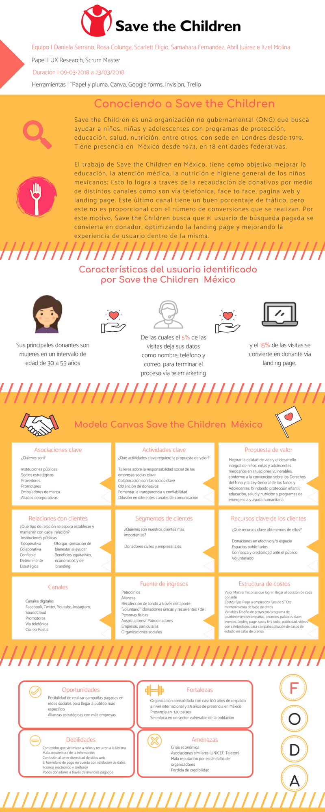
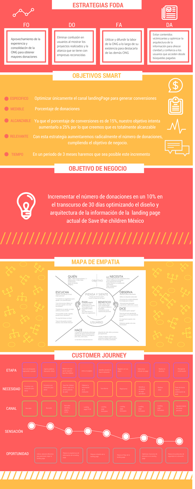
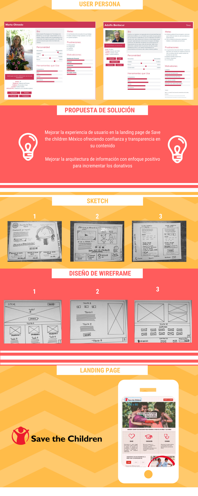

 Landing page Save the children México

 Optimización de la landing page de STCM con el objetivo de general más conversiones de donación a la organización.

Para la realización de este proyecto se hizo uso de las metodologías ágiles Desing thinking, Kanban y Scrum para desarrollar el producto en un tiempo estimado de 3 semanas.

Herramientas

Trello
Canva
Figma
Google forms

#Desarrollo del Producto

